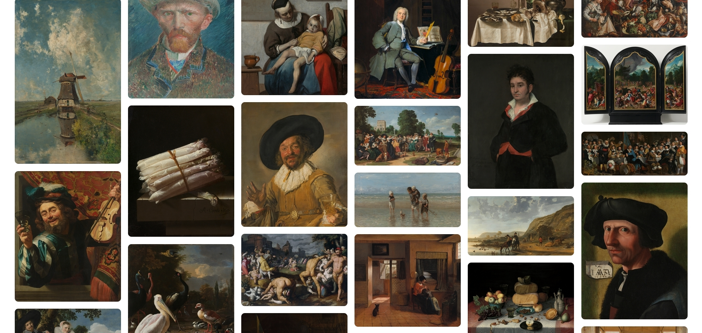

# Week 1

In de eerste week heb ik een visitekaartje gemaakt. Dit heb ik met behulp van HTML, CSS en JavaScript gedaan. Het visitekaartje was de introductieopdracht. Als huijsstijl voor het visitekaartje heb ik de interface van Windows 98 geïmiteerd. 

Hieronder het eindresultaat: 


Ik snap de verwarring, maar ik ben niet de hond op het plaatje. Dat is een placeholder image. Ik ben er niet aan toegekomen om het plaatje te veranderen en heel eerlijk vind ik mijzelf wel prima als een hond. Je kan met de ‘files’ interacteren door er op te klikken, waardoor de ‘dit ben ik’ window en de ‘mail mij’ window geopend worden. Je kan de ‘dit ben ik’ window ook draggen over de pagina. 

# Week 2

In de tweede week ben ik begonnen aan de Single Page Web App. In deze opdracht moet ik aan de hand van een API van een gekozen user story (in mijn geval de user story ‘As an art lover, I want to be able to search and view art from the Rijksmuseum at home, so that I can still enjoy art during a lockdown’) een app designen, bouwen en testen. Hierbij gebruik ik HTML, CSS en JavaScript.

## De schets

Eerst was ik begonnen met het schetsen van de pagina. 

Hieronder het resultaat:


De pagina is vrij simpel, ik heb een homepage met een search bar, een card met het schilderij erin en een detail pagina. Op mobiel zijn de cards over een column verdeeld. Hoe groter het scherm, hoe meer colums er tevoorschijn komen.

## De code

### Het fetchen van de API

Mijn app moet dus de gebruiker de optie geven om kunst op de app op te zoeken, en om de kunst in detail weer te geven. Hiervoor heb ik de API van het Rijksmuseum gebruikt. Deze API haalt data op (in dit geval de kunst) en stopt deze in de code.

```jsx
fetch(`${endpoint}?key=${apiKey}&format=json&type=painting&ps=200`)
  .then(response => response.json())
  .then(data => {
    const paintings = data.artObjects;
    const imagesContainer = document.getElementById('images-container');

    for (let i = 0; i < paintings.length; i++) {
      const painting = paintings[i];
      const imageUrl = painting.webImage.url;
      const imageTitle = painting.title;

      const imageElement = document.createElement('img');
      imageElement.src = imageUrl;
      imageElement.alt = imageTitle;
      imageElement.loading = 'lazy';

      imagesContainer.appendChild(imageElement);
    }
  })
  .catch(error => {
    console.error(error);
  });
```

Met de JavaScript code hierboven fetch ik de data van de API. De code creëert dan een image element voor elk schilderij aan de hand van de URL en de titel van de image. Hierna worden de images naar een container met een ID gestuurd, genaamd ‘images-container’ (heel creatief). 

Aan het einde van de link in de eerste regel code staat ps=200. Dit betekent dat er 200 images op de pagina weergegeven worden. Dit werkt niet met de reden dat het maximale aantal 100 images is.

De onderste regels code zijn voor het omgaan met errors.

```html
	<div id="images-container"></div>
```

### De zoekfunctie en het filteren van de images

Om een zoek functie aan de site toe te voegen heb ik de volgende code gebruikt:

```html
<input id="search-input" type="search" placeholder="Zoek kunst">
```

Eerst heb ik een input element aangemaak, waarin de gebruiker zijn/haar gewenste schilderij in kan tikken.

```jsx
function filterImages(query) {
    const images = document.querySelectorAll("#images-container img");
  
    images.forEach((image) => {
      const title = image.getAttribute("title");
      const alt = image.getAttribute("alt");
  
      if (title && title.toLowerCase().includes(query) ||
          alt && alt.toLowerCase().includes(query)) {
        image.style.display = "block";
      } else {
        image.style.display = "none";
      }
    });
  }
  
  const searchInput = document.getElementById("search-input");
  
  searchInput.addEventListener("input", (event) => {
    const query = event.target.value.toLowerCase();
    filterImages(query);
  });
```

Daarna heb ik een functie aangemaakt in JavaScript. De JavaScript code luistert naar de input van de gebruiker en filtert de images gebaseerd op de search query. De If Else code laat de images zien die matchen met de search query van de gebruiker en zet de display op none voor images die niet matchen met de search query van de gebruiker. 

# Week 3

## De code

### Het toevoegen van een pop-up functie

Dit koste me flink wat tijd, maar met behulp van ChatGPT is het me gelukt om een pop-up functie toe te voegen aan de web-app.

Hieronder het resultaat:


Als je op een kunstwerk klikt, opent de pop-up. Als je op het kruisje klikt, sluit de pop-up. 

De HTML en JavaScript zien er zo uit:

```html
<div id="modal" class="modal">
	<div class="modal-content">
	  <span class="close">&times;</span>
	  <h2 id="modal-title"></h2>
	  
	  <p id="modal-description"></p>
	</div>
</div>
```

## Nieuwe documenten en een frisse look

Omdat de code voor mijzelf en mogelijk voor anderen veel onoverzichtelijker werd, heb ik besloten nieuwe documenten met nieuwe code aan te maken. Daarbij kwam een nieuwe stijl, omdat ik vond dat de oude stijl wel wat beter kon. 

Daarom presenteer ik met trots:




Een aantal dingen die ik heb toegevoegd:

- Full-width image-container (de class met de schilderijen)
- Masonry voor de schilderijen
- Een router

```jsx
/*!
 * routie - a tiny hash router
 * v0.3.2
 * http://projects.jga.me/routie
 * copyright Greg Allen 2016
 * MIT License
*/
var Routie=function(a,b){var c=[],d={},e="routie",f=a[e],g=function(a,b){this.name=b,this.path=a,this.keys=[],this.fns=[],this.params={},this.regex=h(this.path,this.keys,!1,!1)};g.prototype.addHandler=function(a){this.fns.push(a)},g.prototype.removeHandler=function(a){for(var b=0,c=this.fns.length;c>b;b++){var d=this.fns[b];if(a==d)return void this.fns.splice(b,1)}},g.prototype.run=function(a){for(var b=0,c=this.fns.length;c>b;b++)this.fns[b].apply(this,a)},g.prototype.match=function(a,b){var c=this.regex.exec(a);if(!c)return!1;for(var d=1,e=c.length;e>d;++d){var f=this.keys[d-1],g="string"==typeof c[d]?decodeURIComponent(c[d]):c[d];f&&(this.params[f.name]=g),b.push(g)}return!0},g.prototype.toURL=function(a){var b=this.path;for(var c in a)b=b.replace("/:"+c,"/"+a[c]);if(b=b.replace(/\/:.*\?/g,"/").replace(/\?/g,""),-1!=b.indexOf(":"))throw new Error("missing parameters for url: "+b);return b};var h=function(a,b,c,d){return a instanceof RegExp?a:(a instanceof Array&&(a="("+a.join("|")+")"),a=a.concat(d?"":"/?").replace(/\/\(/g,"(?:/").replace(/\+/g,"__plus__").replace(/(\/)?(\.)?:(\w+)(?:(\(.*?\)))?(\?)?/g,function(a,c,d,e,f,g){return b.push({name:e,optional:!!g}),c=c||"",""+(g?"":c)+"(?:"+(g?c:"")+(d||"")+(f||d&&"([^/.]+?)"||"([^/]+?)")+")"+(g||"")}).replace(/([\/.])/g,"\\$1").replace(/__plus__/g,"(.+)").replace(/\*/g,"(.*)"),new RegExp("^"+a+"$",c?"":"i"))},i=function(a,b){var e=a.split(" "),f=2==e.length?e[0]:null;a=2==e.length?e[1]:e[0],d[a]||(d[a]=new g(a,f),c.push(d[a])),d[a].addHandler(b)},j=function(a,b){if("function"==typeof b)i(a,b),j.reload();else if("object"==typeof a){for(var c in a)i(c,a[c]);j.reload()}else"undefined"==typeof b&&j.navigate(a)};j.lookup=function(a,b){for(var d=0,e=c.length;e>d;d++){var f=c[d];if(f.name==a)return f.toURL(b)}},j.remove=function(a,b){var c=d[a];c&&c.removeHandler(b)},j.removeAll=function(){d={},c=[]},j.navigate=function(a,b){b=b||{};var c=b.silent||!1;c&&o(),setTimeout(function(){window.location.hash=a,c&&setTimeout(function(){n()},1)},1)},j.noConflict=function(){return a[e]=f,j};var k=function(){return window.location.hash.substring(1)},l=function(a,b){var c=[];return b.match(a,c)?(b.run(c),!0):!1},m=j.reload=function(){for(var a=k(),b=0,d=c.length;d>b;b++){var e=c[b];if(l(a,e))return}},n=function(){a.addEventListener?a.addEventListener("hashchange",m,!1):a.attachEvent("onhashchange",m)},o=function(){a.removeEventListener?a.removeEventListener("hashchange",m):a.detachEvent("onhashchange",m)};return n(),b?j:void(a[e]=j)};"undefined"==typeof module?Routie(window):module.exports=Routie(window,!0);
```

- Modules


# Week 4

In de laatste week heb ik het project opgeschoond en heb ik het laten nakijken door klasgenoten.

## Wat ik heb geleerd

Kort samengevat, wat zijn de dingen die ik geleerd heb tijdens dit project?

<li>
  <ul>Ik heb geleerd hoe ik modules kan gebruiken om mijn JavaScript op te schonen</ul>
  <ul>Ik heb geleerd hoe ik data uit een API kan fetchen aan de hand van de fetch method</ul>
  <ul>Ik heb geleerd hoe ik de data uit de API in HTML elementen kan stoppen</ul>
  <ul>Ik heb geleerd hoe ik een loading state en een error state kan toevoegen</ul>
  <ul>Ik heb geleerd hoe ik de data uit de API aan de hand van JavaScript kan filteren en hiermee een zoekfunctie kan maken</ul>
  <ul>Ik heb geleerd hoe ik beter met CSS grid kan werken</ul>
  <ul>Ik heb geleerd hoe ik grid-template-rows: masonry kan toepassen</ul>
  <ul>Ik heb geleerd hoe ik een pop-up kan maken</ul>
</li>

# Herkansing 


